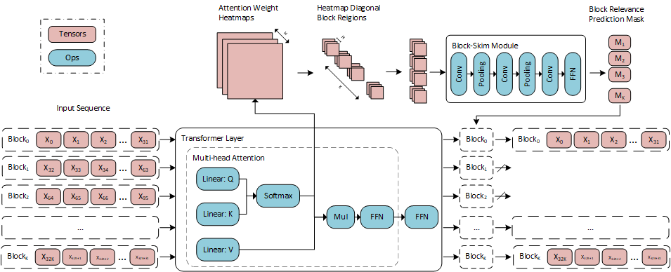

# Block-Skim: Efficient Question Answering for Transformer

## Abstract
Transformer models have achieved promising results on nat-ural  language  processing  (NLP)  tasks  including  extractivequestion  answering  (QA).  Common  Transformer  encodersused in NLP tasks process the hidden states of all input to-kens in the context paragraph throughout all layers. However,different from other tasks such as sequence classification, an-swering the raised question does not necessarily need all thetokens in the context paragraph. Following this motivation,we propose Block-Skim, which learns to skim unnecessarycontext  in  higher  hidden  layers  to  improve  and  acceleratethe Transformer performance. The key idea of Block-Skimis to identify the context that must be further processed andthose  that  could  be  safely  discarded  early  on  during  infer-ence. Critically, we find that such information could be suf-ficiently  derived  from  the  self-attention  weights  inside  theTransformer model. We further prune the hidden states cor-responding to the unnecessary positions early in lower lay-ers, achieving significant inference-time speedup. To our sur-prise, we observe that models pruned in this way outperformtheir full-size counterparts. Block-Skim improves QA mod-els’ accuracy on different datasets and achieves3×speedupon BERT<sub>base</sub> model.

## Overview
### Overall scheme of Block-Skim

### 5 times speedup with no accuracy loss on SQuAD

### Compatible acceleration with model compression methods
SQuAD-1.1            |  HotpotQA
:-------------------------:|:-------------------------:
  |  

## How to use

### Requirements

1. Install [Anaconda](https://www.anaconda.com/products/individual-d). 

2. Install dependencies with Anaconda. 

``` conda create --name blockskim --file requirements.txt ```

3. Activate installed anaconda virtual environment.

` conda activate blockskim `

### Datasets

1. SQuAD
   
Download SQuAD-1.1 datasets from the following links.

* [train-v1.1.json](https://rajpurkar.github.io/SQuAD-explorer/dataset/train-v1.1.json)
* [dev-v1.1.json](https://rajpurkar.github.io/SQuAD-explorer/dataset/dev-v1.1.json)

2. MRQA datasets

We use SearchQA, NewsQA, NaturalQuestions and TriviaQA datasets in MRQA format. Download the MRQA datasets from its [official repository](https://github.com/mrqa/MRQA-Shared-Task-2019).

3. HotpotQA
   
Download HotpotQA dataset from 